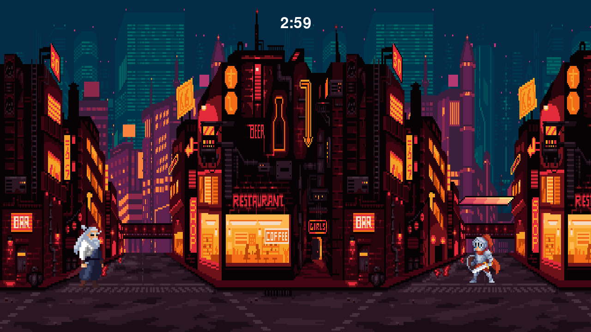
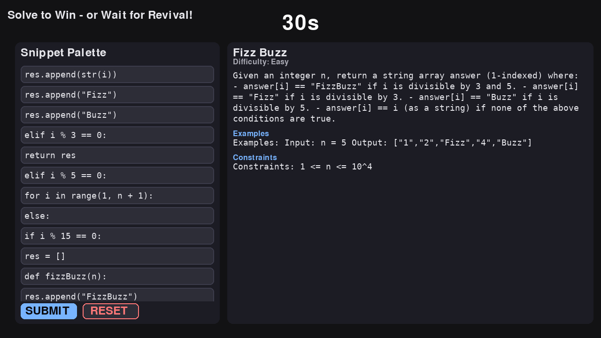
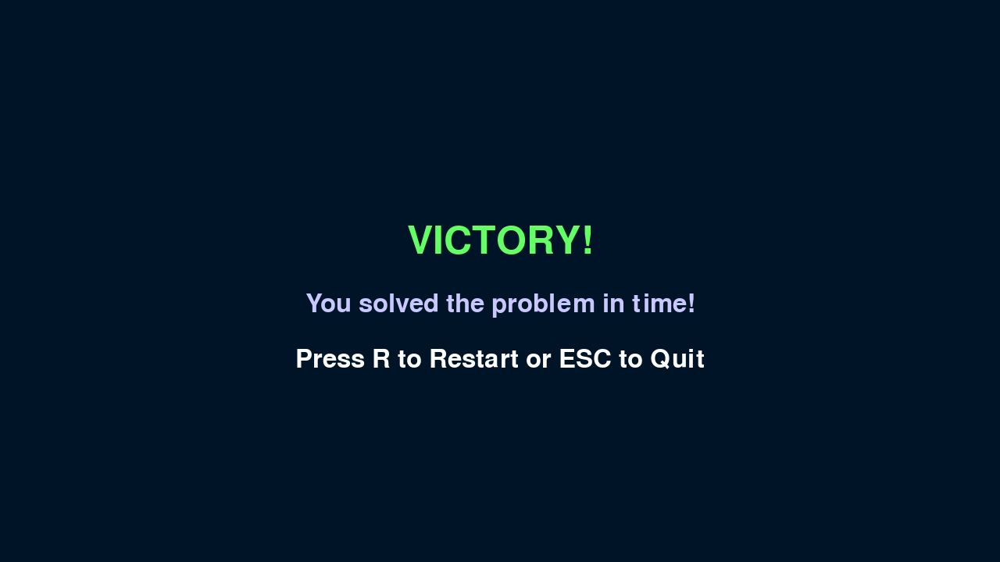

# Gameplay Loop:
Defeat the evil knight, and solve a leetcode problem by dragging and dropping the code blocks into the correct position! Time is of the essence

# Goal
Get speedier at Leetcode problems, and get practice in a roguelike experience.

# How to Run

```bash
python3 main.py
```

Or directly:
```bash
python3 controller.py
```

## Game Flow

1. **Arena Mode**: Fight the Knight as the Samurai
   - Controls: A/D to move, SPACE to attack
   
2. **Knight Death**: When the Knight dies, switch to LeetCode mode
   
3. **LeetCode Mode**: Solve a coding problem in 30 seconds
   - Drag and drop code snippets into correct order
   - Click SUBMIT to check answer
   
4. **Outcomes**:
   - Solve correctly: Victory!
   - Timer expires: Knight revives, return to Arena

## Screenshots

### Arena Mode


### LeetCode Mode


### Victory State


# Architecture

The game uses a compositor pattern with separate surfaces:
- `controller.py`: Main game controller managing state transitions
- `arena.py`: Arena fighting game (renders to surface)
- `lc_screen.py`: LeetCode problem UI (renders to surface)

See [RUNNING.md](RUNNING.md) for detailed controls and architecture.

# Art Credits:

- Samurai: https://xzany.itch.io/samurai-2d-pixel-art
- Knight: https://xzany.itch.io/free-knight-2d-pixel-art
- Background: https://ansimuz.itch.io/cyberpunk-street-environment
- Health bar: https://bdragon1727.itch.io/basic-pixel-health-bar-and-scroll-bar
